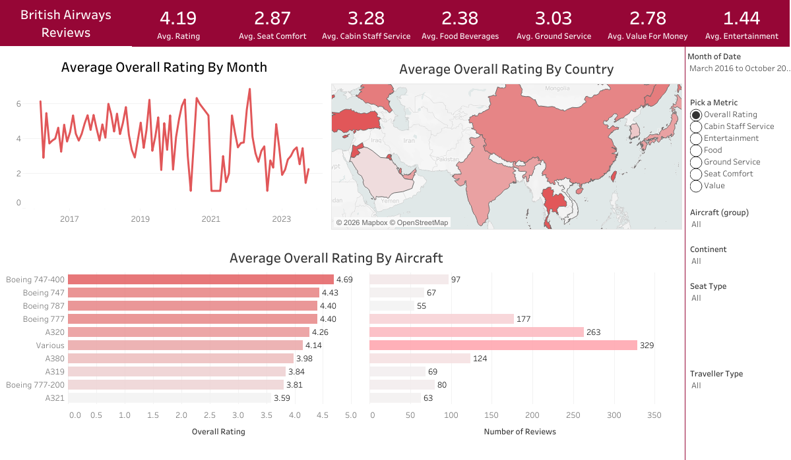

# ✈️ British Airways Customer Experience & Rating Analysis

> **Project Overview:** Uncovering what truly drives passenger satisfaction at British Airways—an interactive deep dive into customer reviews across cabin classes, aircraft fleets, and global routes.

👉 **[View Interactive Dashboard on Tableau Public]([YOUR_TABLEAU_PUBLIC_URL_HERE](https://public.tableau.com/views/BritishAirways_Reviews_Dashboard/Dashboard?:language=en-US&publish=yes&:sid=&:redirect=auth&:display_count=n&:origin=viz_share_link))**

---

# 📊 Dashboard Preview

---

# 🎯 Business Objectives & Key Questions
**Customer Satisfaction Trends:** How do overall ratings fluctuate across different travel dates and seasons?
**Fleet Performance Analysis:** Which aircraft types (e.g., Boeing 747-400, A380, A320) score highest in passenger satisfaction?
**Service Bottlenecks:** How do individual ratings for **Cabin Staff Service**, **Food & Beverages**, **Seat Comfort**, and **Ground Service** compare?
**Geographical Insights:** What are the average rating distributions by origin country/continent?

---

## 🛠️ Tools & Technologies
**Data Visualization:** Tableau Desktop (Public Edition)
**Data Sources:** `ba_reviews.csv`, `Countries.csv`
**Key Features Implemented:**
  * Dynamic Parameter switching (`Pick a Metric`) across 7 rating categories
  * CASE-based calculated fields
  * Interactive Dashboard Action Filters (filtering by aircraft and location)
  * Dual-axis timeline charts and geographical maps

---

## 📂 Repository Structure

| File Name | Description |
| :--- | :--- |
| `BritishAirways_Reviews_Dashboard.twbx` | Packaged Tableau Workbook containing full data and interactive dashboard |
| `BritishAirways_Reviews_Dashboard.png` | High-resolution preview image of the final dashboard |
| `ba_reviews.csv` | Primary dataset containing raw customer reviews and ratings |
| `Countries.csv` | Auxiliary geographical mapping data |

---

## 💡 Key Insights & Findings
1. **Aircraft Differences:** Wide-body aircraft used for long-haul routes (e.g., Boeing 747-400) receive significantly higher overall rating averages than short-haul fleets.
2. **Service Gaps:** Ground Service and Food & Beverages ratings show more score variability compared to consistently higher Cabin Staff Service scores.
3. **Metric Flexibility:** Using dynamic parameters allows stakeholders to instantly pivot the entire dashboard view between individual service touchpoints.
